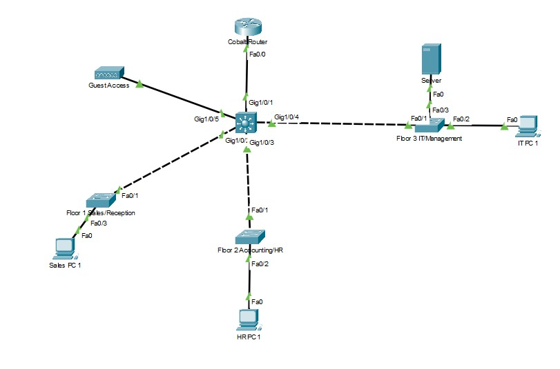
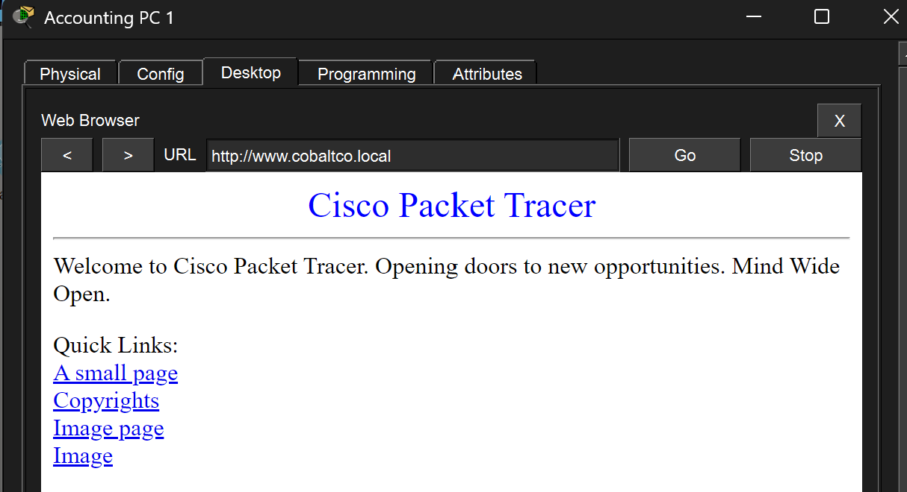

# Cobalt Co - Network Design
Multi-floor office network design (subnetting, DHCP, RIP) for a fictional small business, built and tested in Cisco Packet Tracer.
## Overview 
This project simulates a network design engagement for a fictional small consulting firm, Cobalt Co., as it moves into a new 3 floor office building. The design supports approximately 50 emplyees across Sales, Accounting, HR, and IT/Management, with a dedicated guest wireless network for visitors. Built and tested in Cicso Packet Tracer, this project demonstrates subnetting, DHCP, configuration, and dynamic routing in a realistic small-business network topology. 

## Network Requirements

- Support ~50 employees across 3 floors: Sales/Reception, Accounting/HR, and IT/Management
- Provide a separate guest wireless network for customers/visitors for internet access 
- Use VLSM subnetting to size each subnet appropriately with minimal waste 
- Route between floor subnets using a Layer 3 core switch (no VLANs/trunking)
- Use RIP to advertise all internal subnets between the core switch and edge router 
- Provide DHCP for all end-user devices per floor, including a separate DHCP pool for guest wireless 
- Statically assign IPs to servers, the core switch's routed interfaces, and the core-to-edge router link 
- Centralize DNS, HTTP, and HTTP services on a single server in the IT/Management server room 
- Keep guest wireless traffice logically separate from internal department traffic (own subnet, own DNS, own swith uplink)
- Design with room for future growth

## Physical Layout

The Cobalt Co. Consulting network uses a single Layer 3 core switch as the distribution point for all floor subnets, with one edge router (Cobalt Router) handling the boundary to the ISP.

| Core Switch Port | Connects To |
|---|---|
| Gig1/0/1 | Cobalt Router (edge router / ISP boundary) |
| Gig1/0/2 | Floor 1 Sales/Reception switch |
| Gig1/0/3 | Floor 2 Accounting/HR switch |
| Gig1/0/4 | Floor 3 IT/Management switch (server room + IT PC) |
| Gig1/0/5 | Guest Access switch (isolated guest wireless subnet) |

Each floor swith is Layer 2 only (access switches simply forward frames to an end device). All inter-subnet routing happens at the core swith via routed interfaces (no VLANs or trunking required because each port is its subnet). The Cobalt Router connects the core switch to the ISP cloud and would handle NAT for internet-bound traffice. 

Guest Access is deliberately connected to its dedicated port (Gig1/0/5) rather than sharing a swith with Sales/Reception in order to keep guest traffic in its own broadcast domain. 

## IP Addressing Scheme 

| Floor/Segment | Network | CIDR | Subnet Mask | Gateway | Usable Range | Broadcast |
|---|---|---|---|---|---|---|
| Accounting/HR | 192.168.10.0 | /27 | 255.255.255.224 | 192.168.10.1 | 192.168.10.2 - 192.168.10.31 | 192.168.10.31 |
| Sales/Reception | 192.168.10.32 | /27 | 255.255.255.224 | 192.168.10.33 | 192.168.10.34 - 192.168.10.62 | 192.168.10.63 |
| IT/Management | 192.168.10.64 | /27 | 255.255.255.224 | 192.168.10.65 | 192.168.10.66 - 192.168.10.94 | 192.168.10.95 |
| Guest Wireless | 192.168.10.96 | /28 | 255.255.255.240 | 192.168.10.97 | 192.168.10.98 - 192.168.10.110 | 192.168.10.111 |
| Core-Edge Link | 192.168.10.112 | /30 | 255.255.255.252 | N/A (point-to-point) | 192.168.10.113 - 192.168.10.114 | 192.168.10.115 |
## Design Decisions 

### 1. IP Addressing & Subnetting 
 **Approach:** VLSM subnetting was used starting fromt 192.168.10.0/24

 - Accounting/HR, Sales/Reception, and IT/Management each received a /27 (30 useable addresses), sized to comfortably cover each floor's device count plus room for growth. 
 - Guest Wireless received a smaller /28 (14 useable addresses), since guest device counts may vary and are expected to be low and doesn't need the same available addresses as the staff subents. 
 - A /30 was reserved for the point-to-point link between the core switch and edge router, since only two devices (one interface on each side) occupy that link sizing it any larger would be a waste of address space. 
 - Remaining address space in the /24 (beyond .115) is left unused, available for future subnets if the office adds departments or device counts grow. 

 ### 2. Distribution Layer: Layer 3 Switch Vs Router-per-floor

 Rather than using a dedicated router for each floor, this design uses a single Layer 3 core switch with routed interfaces per floor subnet, connected to one edge router (Cobalt Router) for internet access. This mirrors typical small/mid-size business deployments where: 
    - Access switches (Floor 1, 2, 3, and Guest Wireless) forward frames within their segment.
    - The Layer 3 core switch handles inter-subnet routing, which is cheaper and faster than routing internal traffic through dedicated routers. 
    - A single edge router handles the boundary to the ISPm where routing between networks occur.

This reduces the cost and hardware count compared to router-per-floor design while still meeting all subnetting, DHCP, and routing requirements. 

### 3. DHCP Design

- DHCP is used for all end-user devices to reduce administrative overhead and support scalability as the office gorws, rather than statically configuring each PC. 
- Static IPs were reserved for the server (DNS/DHCP/HTTP), and for the core switch's routed interface and the core-to-edge router link. 
- Each floor subnet has its own DHCP pool, with the pool's starting address offset past the gateway and a small number of reserved address for statics. 
- The Guest Wireless DHCP pool assigns a public DNS server (8.8.8.8) instead of the internal DNS server, so guest devices can't communicate with internal DNS records. (This does not fully isolate guest traffic from internal subnets, since RIP still advertises all subnets to each otehr. An ACL is planned for future integration).

### 4. Phsyical Topology Choices 

- One access swith per floor keeps traffic local to that floor and simplifies troubleshooting (issues on one floor don't require going through another floor's switch)
- The server (DNS/DHCP/HTTP) sits in the IT/Management server room, directly connected to the Floor 3 switch. This allows it to be central to network and physically secured alonside IT/Management staff. 
- Guest Access connects via its own dedicated switch and its own port on the core swith (Gig1/0/5), rather than sharing a switch or uplink with Sales/Reception. Since this design doesn't use VLANs, every port on an acceess switch shares the same broadcast domain giving Guest ACcess its own switch and routed port is what keeps guest traffic in its own subnet without requiring trunking. 
## Configuration Highlighs 

## Testing & Verification 
 **Problem:** DHCP clients not receiving IP Addresses

**Symptom:** PCs on Sales/Reception, Accounting/HR, and Guest Wireless were not pulling IP addresses via DHCP. The IT/Management PC did not fail to obtain an address.

**Root Cause 1 - IP misconfiguraiton**
The core switch's routed interfaces had been assigned incorrect IPs, off by one from the documented gateway address. 

**Root Cause 2 - Duplicate Address Conflict**
After ensuring that IT/Management was receiving the correct IP addresses, the switch logged "%IP-4-DUPADDR: Duplicate address 192.168.10.65 on FastEthernet0/4, sourced by 0090.0cdb.dee5". 
Traced via "show mac address-table" to identify what it turned out to be, the IT/Management PC had been statically configured to 192.168.10.65 instead of set to DHCP. 

**Resolution**
1. Corrected all three routed intereface IPs to match the IP addressing table. 
2. Reconfigured the conflicting end device to use DHCP. 
3. Verified the server's Default Gateway field was set to "192.168.10.65" (not .66), since these had been mixed in the intial configuration. 
4. Re-tested DHCP on all four subnet and confirmed each PC pulled an addres from the correct pool with the correct gateway. 

**Verification Commands Used:**
- show ip interface brief 
- show mac address-table 
- show run 

### Test: End-to-End Connectivity via DNS and HTTP
**Objective**
Confirm that a client on a floor subnet can obtain a DHCP lease, resolve an internal hostname via DNS, and load a page hosted on the centralized server. Validating the full stack works together (DHCP -> routing -> DNS -> HTTP).

**Steps**
1. Configured DNS service on the Server-PT with an A record (www.cobaltco.local -> 192.168.10.66)
2. Enabled HTTP service on the same server 
3. From Accounting PC 1 (leased via DHCP on the 192.168.10.0/27 subnet), opened the Desktop web browser. 
4. Navigated to "http://www.cobaltco.local"

**Results**
Page loaded successfully, confirming: 
- PC received a valid DHCP lease with correct gateway and DNS server 
- Core switch routed traffice from ACcounting/HR subnet to IT/Management subnet via RIP 
- DNS resolved the hostname to the server's IP 
- HTTP service provided the page correctly 

## SKills Demonstrated 

## Tools Used 
